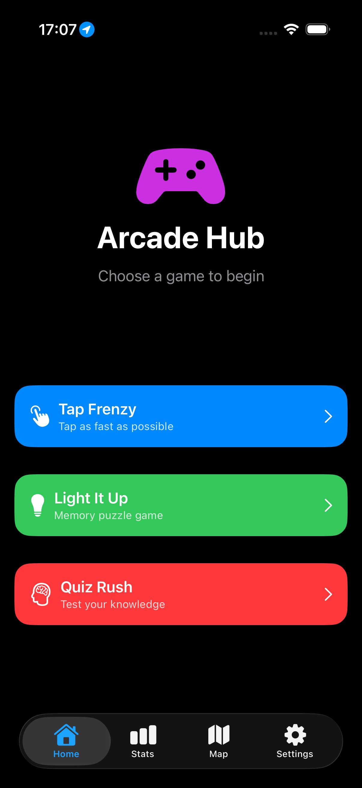
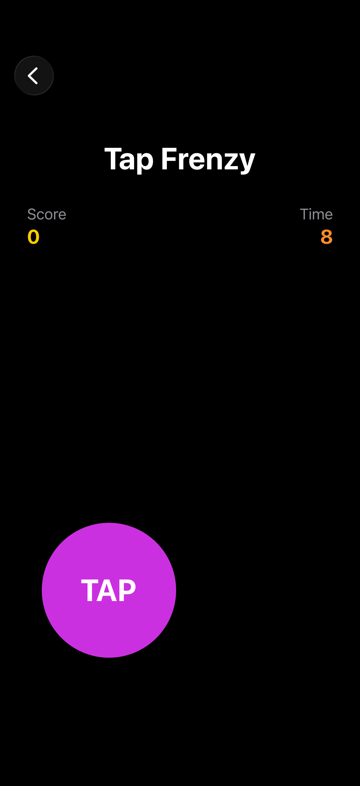
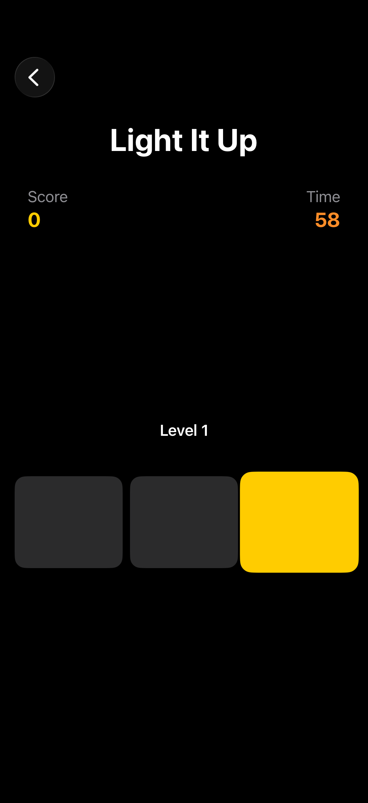
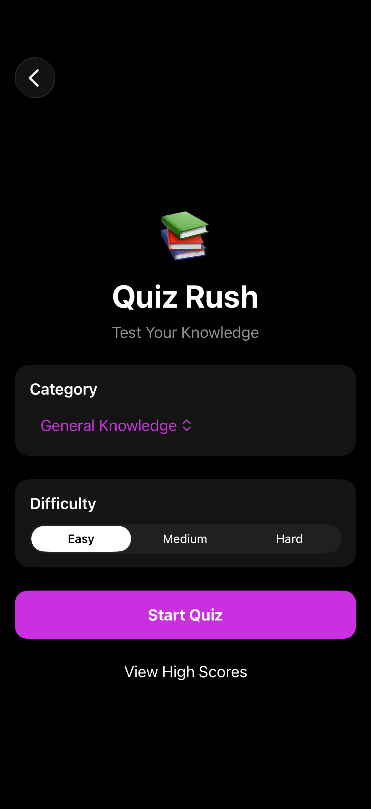
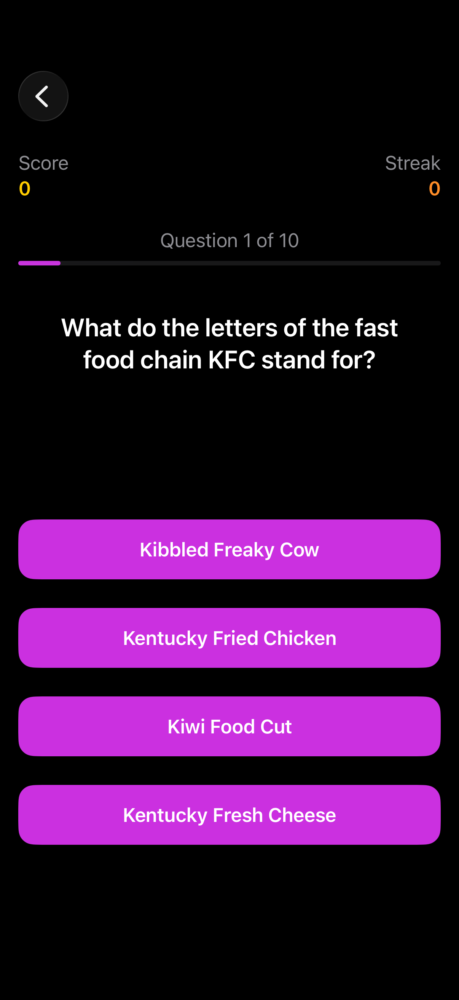
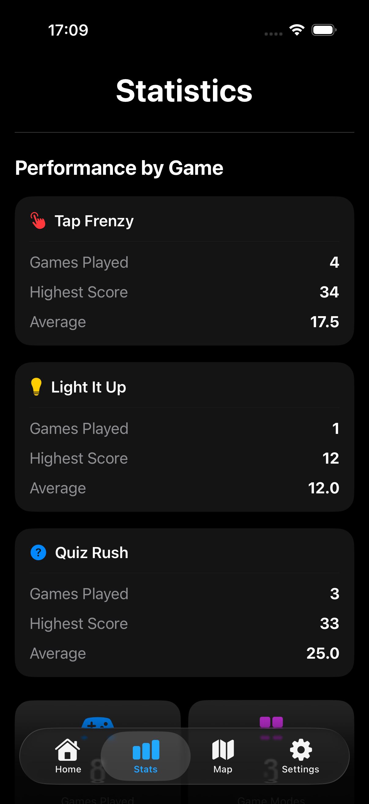
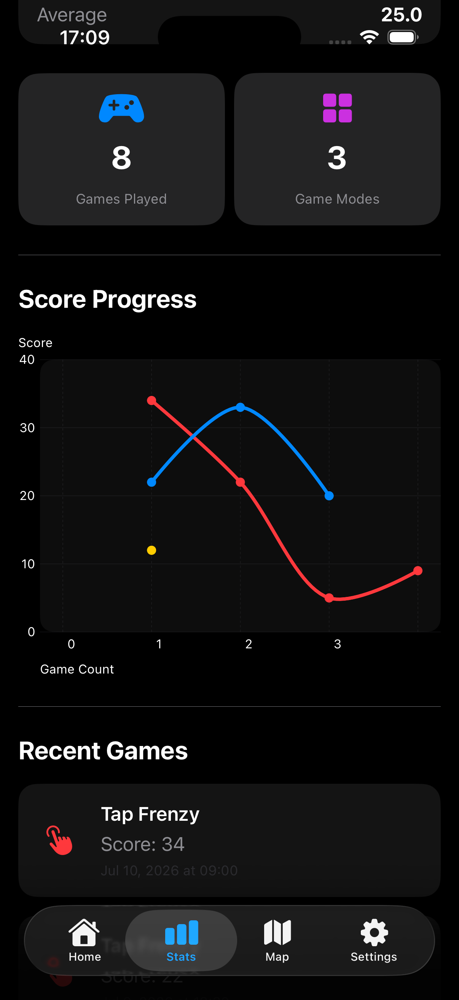
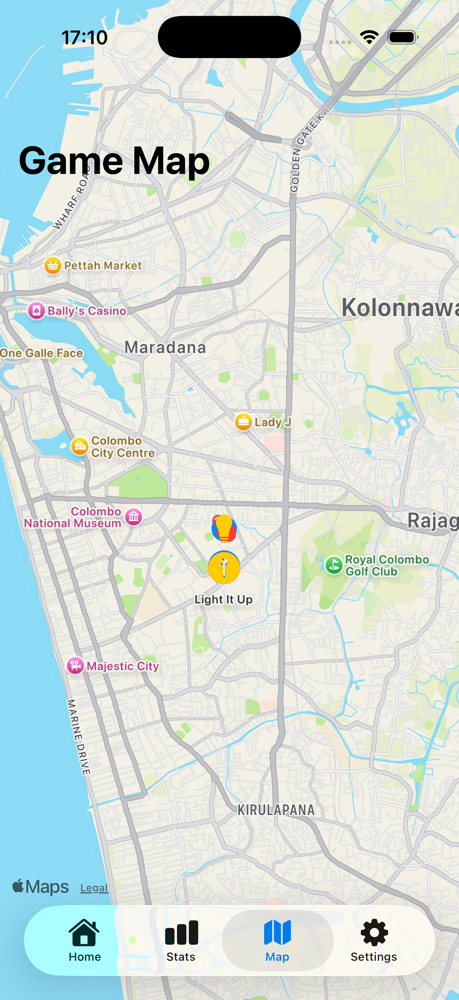
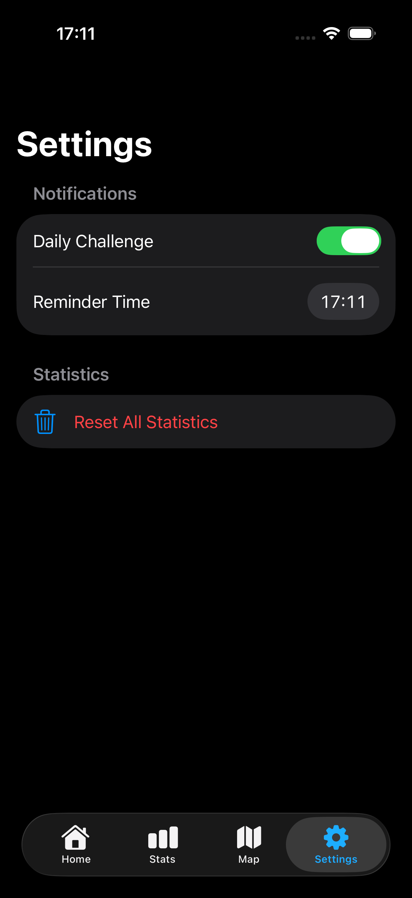

# 🎮 Game Hub — iOS Gaming Hub

A modern multi-game iOS application developed using **SwiftUI** over four weeks of iOS Application Development coursework.

The application combines three unique mini-games into a single experience while showcasing modern iOS development techniques including MVVM architecture, Swift Charts, MapKit, Core Location, Local Notifications, persistent data storage, and REST API integration.

---

# Table of Contents

- Overview
- Tech Stack
- Architecture
- Folder Structure
- Features by Week
- Setup & Running
- Known Limitations
- Future Improvements
- Reflection
- Author

---

# Overview

Game Hub is a native iOS application that brings together three interactive mini-games within a unified dark-themed interface. Each game offers a unique gameplay experience while sharing a common statistics system, allowing players to monitor their performance across all games.

The application demonstrates the use of modern Apple frameworks and follows the **Model-View-ViewModel (MVVM)** architectural pattern to separate presentation, business logic, and data management.

Throughout the four-week development period, the project gradually evolved from a single mini-game into a feature-rich gaming hub incorporating statistics, maps, notifications, persistent storage, and online API integration.

---

# Tech Stack

| Technology | Usage |
|------------|-------|
| Swift | Core programming language |
| SwiftUI | User Interface development |
| MVVM | Application architecture |
| Combine | Timer publishers and reactive updates |
| Swift Charts | Statistics dashboard |
| MapKit | Interactive map interface |
| Core Location | User location tracking |
| UserNotifications | Daily challenge reminders |
| UserDefaults | Persistent local storage |
| Codable | JSON encoding and decoding |
| NavigationStack | Navigation between views |
| Open Trivia Database API | Quiz Rush questions |
| Xcode | Development environment |
| Git & GitHub | Version control |

---

# Architecture

Game Hub follows the **Model-View-ViewModel (MVVM)** architecture.

```
                    SwiftUI Views
┌──────────────────────────────────────────────────────────┐
│                                                          │
│ Home                                                     │
│ Tap Frenzy                                               │
│ Light It Up                                              │
│ Quiz Rush                                                │
│ Statistics                                               │
│ Map                                                      │
│ Settings                                                 │
│ Shared Components                                        │
│                                                          │
└───────────────────────┬──────────────────────────────────┘
                        │
                ObservableObjects
                        │
┌───────────────────────▼──────────────────────────────────┐
│                                                          │
│ QuizRushViewModel                                        │
│ StatsViewModel                                           │
│ SettingsViewModel                                        │
│                                                          │
└───────────────────────┬──────────────────────────────────┘
                        │
                    Services Layer
                        │
┌───────────────────────▼──────────────────────────────────┐
│                                                          │
│ TriviaAPIService                                         │
│ GameSessionService                                       │
│ NotificationService                                      │
│ LocationService                                          │
│                                                          │
└───────────────────────┬──────────────────────────────────┘
                        │
                      Models
┌──────────────────────────────────────────────────────────┐
│                                                          │
│ GameSession                                              │
│ TriviaQuestion                                           │
│ TriviaCategory                                           │
│ TriviaResponse                                           │
│ QuizViewState                                            │
│                                                          │
└──────────────────────────────────────────────────────────┘
```

### Architecture Principles

- SwiftUI Views are responsible only for presenting the user interface.
- ViewModels manage business logic and application state.
- Services provide reusable functionality such as networking, notifications, location services, and session storage.
- Models represent application data and conform to Codable where required.
- Persistent data is stored locally using UserDefaults and JSON encoding.

---

# Folder Structure

```

GameHub/
├── Extension
│   └── StringExtensions.swift
├── Models
│   ├── GameMode.swift
│   ├── GameSession.swift
│   ├── TriviaCategory.swift
│   ├── TriviaQuestion.swift
│   └── TriviaResponse.swift
├── Services
│   ├── GameSessionService.swift
│   ├── LocationService.swift
│   ├── NotificationService.swift
│   └── TriviaAPIService.swift
├── ViewModels
│   ├── LightItUp
│   │   └── LightItUpViewModel.swift
│   ├── Others
│   │   ├── MapViewModel.swift
│   │   ├── SettingsViewModel.swift
│   │   └── StatsViewModel.swift
│   ├── QuizRush
│   │   ├── QuizRushViewModel.swift
│   │   └── QuizViewState.swift
│   └── TapFrenzy
│       └── TapFrencyViewModel.swift
├── Views
│   ├── Components
│   │   ├── GameMapAnnotation.swift
│   │   ├── GameStatisticsCard.swift
│   │   ├── PrimaryButton.swift
│   │   ├── RecentGameCard.swift
│   │   ├── ScoreBadge.swift
│   │   ├── SectionCard.swift
│   │   └── SessionDetailView.swift
│   ├── Home
│   │   └── HomeView.swift
│   ├── LightItUp
│   │   └── LightItUpView.swift
│   ├── Main
│   │   └── MainTabView.swift
│   ├── QuizRush
│   │   ├── QuizHighScoreView.swift
│   │   ├── QuizResultView.swift
│   │   ├── QuizRushView.swift
│   │   └── QuizSetupView.swift
│   ├── Tabs
│   │   ├── MapView.swift
│   │   ├── SettingsView.swift
│   │   └── StatsView.swift
│   └── TapFrency
│       └── TapFrenzyView.swift
├── Assets
└── iostutorialApp.swift

```

---

# Project Features

The application consists of three fully playable mini-games integrated into a single gaming hub.

- Tap Frenzy
-  Light It Up
-  Quiz Rush

Additional application features include:

-  Statistics Dashboard
-  Swift Charts
-  Interactive Map
-  Location Tracking
-  Daily Notifications
-  Settings
-  Persistent Session Storage
-  Modern Dark Theme
-  Native SwiftUI Interface

---
# Features by Week

The Game Hub application was developed incrementally over four weeks. Each week introduced new functionality while building upon the previous week's work.

---

# Week 1 — Tap Frenzy

**Goal:** Develop the first playable mini-game while learning the fundamentals of SwiftUI state management, timers, animations, and navigation.

| Feature | Description |
|----------|-------------|
| Home Screen | Created the main menu for navigating between games. |
| Navigation | Implemented NavigationStack for screen navigation. |
| Tap Frenzy Game | Built a reaction-based tapping game. |
| Countdown Timer | Added a 10-second game timer using Combine Timer publishers. |
| Score System | Increased score with every successful tap. |
| Moving Target | Randomly repositioned the tap button every few seconds. |
| Dynamic Difficulty | Reduced the tap button size as time decreased. |
| Game Over Screen | Displayed final score after the timer expired. |
| High Score | Stored and displayed the player's highest score using AppStorage. |
| Restart Functionality | Allowed players to instantly start a new game. |
| Dark Theme UI | Designed a consistent dark-themed user interface. |

### Technologies Introduced

- SwiftUI
- NavigationStack
- Combine Timer
- State Management
- GeometryReader
- AppStorage

---

# Week 2 — Light It Up

**Goal:** Introduce a second game with progressively increasing difficulty while improving reusable UI design and game state management.

| Feature | Description |
|----------|-------------|
| Light It Up Game | Developed a grid-based reaction game. |
| Interactive Grid | Players tap illuminated cards before they disappear. |
| Progressive Levels | Game difficulty increases automatically over time. |
| Multiple Grid Sizes | Grid expands as levels increase. |
| Dynamic Colours | Card colours change according to difficulty level. |
| Multiple Active Cards | Higher levels illuminate multiple cards simultaneously. |
| Score Tracking | Correct taps increase score while incorrect taps reduce score. |
| Countdown Timer | 60-second game duration. |
| High Score Storage | Persisted best score using AppStorage. |
| Game Over Screen | Displays final score and high score. |
| Session Recording | Stores completed game sessions for future statistics. |
| Dark Theme UI | Maintained a consistent application design. |

### Technologies Introduced

- LazyVGrid
- AppStorage
- Combine Timer
- Animation
- SwiftUI State Management

---

# Week 3 — Quiz Rush

**Goal:** Build an online quiz game using a REST API while introducing MVVM architecture and asynchronous programming.

| Feature | Description |
|----------|-------------|
| Quiz Rush | Online trivia game powered by the Open Trivia Database API. |
| MVVM Architecture | Separated business logic from SwiftUI views. |
| API Integration | Retrieved live quiz questions using async/await. |
| Category Selection | Players choose quiz categories before starting. |
| Difficulty Selection | Easy, Medium and Hard difficulty options. |
| Question Progress | Progress indicator showing current question number. |
| Score System | Awarded points for correct answers. |
| Streak Bonus | Consecutive correct answers provide bonus points. |
| Penalty System | Incorrect answers reduce score and reset streak. |
| Loading Screen | Displayed while questions were being downloaded. |
| Error Handling | Friendly error screen for connection failures. |
| HTML Entity Decoding | Converted encoded API text into readable questions. |
| Quiz Results Screen | Displayed score, accuracy and performance statistics. |
| High Score Tracking | Stored best quiz score locally. |
| Session Recording | Saved completed quiz sessions for statistics. |

### Technologies Introduced

- MVVM
- ObservableObject
- Published Properties
- Async/Await
- URLSession
- Codable
- REST API Integration
- NavigationDestination

---

# Week 4 — Game Hub Integration

**Goal:** Transform the individual mini-games into a complete application by introducing persistent statistics, location services, notifications, maps, and application settings.

| Feature | Description |
|----------|-------------|
| Statistics Dashboard | Displays application-wide game statistics. |
| Overall Statistics | Shows total games played, highest score and average score. |
| Performance by Game | Displays statistics for each individual game. |
| Swift Charts | Visualises score progression using a line chart. |
| Recent Games | Shows the latest completed game sessions. |
| Session Storage | Stores every completed game using JSON and UserDefaults. |
| Game Session Service | Centralised management of all game sessions. |
| Interactive Map | Displays the user's current location using MapKit. |
| Core Location | Requests and manages user location permissions. |
| Notification Service | Schedules daily challenge reminders. |
| Reminder Settings | Allows players to enable notifications and choose reminder time. |
| Settings Screen | Application preferences and statistics reset. |
| Data Reset | Clears all stored game sessions with confirmation. |
| Modern Dashboard | Improved statistics layout with reusable components. |
| Reusable Components | Score badges, game cards and statistics cards. |
| Dark Theme Consistency | Unified appearance across every screen. |

### Technologies Introduced

- Swift Charts
- MapKit
- Core Location
- User Notifications
- UserDefaults
- JSON Encoding
- Singleton Services
- MVVM Refinement
- NotificationCenter
- ShareLink

# Setup & Running

## Requirements

Before running the application, ensure the following software is installed:

- macOS Sonoma or later
- Xcode 16 or later
- iOS 17+ Simulator or a physical iPhone
- Internet connection (required for Quiz Rush)

---

## Installation

### Clone the repository

```bash
git clone https://github.com/dilukatheekshana/iostutorial/tree/main/iostutorial
```

### Navigate to the project

```bash
cd iostutorial
```

### Open the project

```bash
open iostutorial.xcodeproj
```

or simply double-click the project in Finder.

---

## Running the Application

1. Select an iOS Simulator or connect an iPhone.
2. Build the project using **⌘ + B**.
3. Run the application using **⌘ + R**.
4. Grant Location permission when prompted.
5. Grant Notification permission when prompted.
6. Start playing!

---

# Application Permissions

The application requests the following permissions:

| Permission | Purpose |
|------------|---------|
| Location | Display the user's current location on the map. |
| Notifications | Send daily challenge reminders at the selected time. |
| Internet | Retrieve quiz questions from the Open Trivia Database API. |

---

# Known Limitations

| Area | Limitation |
|------|------------|
| Quiz Rush | Requires an active internet connection to load questions. |
| Session Storage | Game sessions are stored locally using UserDefaults and are not synchronized across devices. |
| Map | Displays only the current user location and does not store historical locations. |
| Notifications | Uses local notifications only; remote notifications are not implemented. |
| Statistics | Charts are generated using locally stored game sessions only. |
| Data Storage | Resetting statistics permanently deletes all saved sessions. |

---

# Screenshots

## Home Screen



---

## Tap Frenzy



---

## Light It Up



---

## Quiz Rush




---

## Statistics Dashboard



---

## Score Progress Chart



---

## Map Screen



---

## Settings Screen



---

# Reflection

## Tap Frenzy

Developing **Tap Frenzy** helped me understand the basics of SwiftUI game development. I learned how to update the user interface using state variables, create timers, detect user taps, and manage a game session from start to finish.

### What I Learned
- Using `@State` to update the UI.
- Working with timers and countdowns.
- Handling button tap events.
- Managing game states.
- Building a responsive user interface.

---

## Light It Up

The **Light It Up** game taught me how to manage multiple interactive objects and create more complex game logic. I learned how to randomize game elements, detect winning conditions, and improve the user experience.

### What I Learned
- Randomizing game data.
- Managing multiple UI states.
- Creating game rules and win conditions.
- Updating the interface based on user actions.
- Improving the user experience.

---

## Quiz Rush

**Quiz Rush** helped me learn how to build a larger SwiftUI application using the MVVM architecture. I also learned how to fetch data from an online API and manage application data.

### What I Learned
- Using the MVVM design pattern.
- Fetching data from an API.
- Decoding JSON using `Codable`.
- Handling asynchronous network requests.
- Managing app state with `ObservableObject` and `@Published`.
- Navigating between multiple screens.
- Saving and displaying high scores.

---

## Shared Components

Besides the games, I created reusable components that made the application more organized and easier to maintain.

### What I Learned
- Creating reusable SwiftUI components.
- Using `NavigationStack` for navigation.
- Sharing data between views.
- Organizing project files.
- Recording game history and displaying statistics.
- Using charts to visualize game performance.
- Saving user data locally.
- Using Git and GitHub for version control.

---

## Overall Reflection

This coursework helped me improve my SwiftUI and iOS development skills. I learned how to build different types of games, create reusable components, organize a project, and solve problems during development. I also gained experience with API integration, data storage, navigation, and version control using Git and GitHub. Overall, this project gave me more confidence in developing complete iOS applications.

---

# Author

**Name:** Diluka Theekshana

**Student ID:** BSCCOMP251P-005

**Module:** iOS Application Development

**Institution:** NIBM

**Framework:** SwiftUI

**Language:** Swift

**Platform:** iOS 17+

**Architecture:** MVVM

**Development Duration:** 4 Weeks

**GitHub:** https://github.com/dilukatheekshana

---

# Acknowledgements

This project makes use of the following technologies and services:

- Apple SwiftUI
- Apple MapKit
- Apple Core Location
- Apple UserNotifications Framework
- Apple Swift Charts
- Open Trivia Database API (https://opentdb.com/)
- Xcode IDE
- Git & GitHub

Special thanks to the lecturers and module materials that guided the development of this project.

